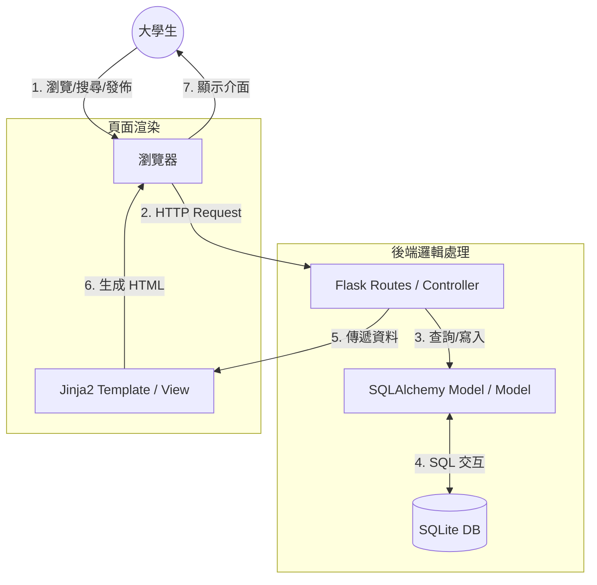

# [剩食與雜物互助系統] 系統架構設計 (Architecture)

## 1. 技術架構說明

本專案採用傳統的 **MVC (Model-View-Controller)** 模式進行開發，並選用輕量且高效的技術堆疊，以確保開發速度與系統靈活性。

### 選用技術與原因
- **後端框架：Flask (Python)**
  - 理由：Flask 是一個微框架，不強制規定專案結構，非常適合快速構建中小型應用程式。
- **模板引擎：Jinja2**
  - 理由：Flask 內建支援，能夠在伺服器端直接將資料渲染進 HTML，對 SEO 友好且開發直觀。
- **資料庫：SQLite**
  - 理由：無需架設獨立的資料庫伺服器，資料儲存於單一檔案中，易於攜帶、備份與部署。
- **前端美化：Vanilla CSS**
  - 理由：避免依賴大型框架帶來的效能冗餘，能精準實現 PRD 中要求的「現代、活潑」視覺設計。

### MVC 模式分工
- **Model (模型)**：負責定義資料表結構（如物品名稱、效期、狀態）以及與 SQLite 資料庫的溝通。
- **View (視圖)**：負責呈現使用者介面，使用 Jinja2 模板動態顯示物品列表與表單。
- **Controller (控制器)**：負責處理使用者的請求（如點擊搜尋、發布物品），執行邏輯運算後決定傳回哪個頁面或資料。

---

## 2. 專案資料夾結構

建議的資料夾組織方式如下，以維持程式碼的可讀性與維護性：

```text
23000000w_people/
├── app/                    # 應用程式核心代碼
│   ├── __init__.py         # 初始化 Flask App、設定檔與資料庫
│   ├── models/             # 資料庫模型 (Model)
│   │   └── item.py         # 物品 (Item) 資料結構定義
│   ├── routes/             # 路由處理 (Controller)
│   │   └── main.py         # 主要頁面路由 (首頁、發佈、搜尋)
│   ├── templates/          # Jinja2 HTML 模板 (View)
│   │   ├── base.html       # 共用版面 (Header, Footer)
│   │   ├── index.html      # 首頁 (物品列表)
│   │   └── create.html     # 發佈新物品頁面
│   └── static/             # 靜態資源
│       ├── css/            # 樣式表 (style.css)
│       └── js/             # 腳本 (main.js)
├── docs/                   # 專案文件
│   ├── PRD.md              # 產品需求文件
│   └── ARCHITECTURE.md     # 系統架構設計文件 (本文件)
├── instance/               # 執行實例檔案
│   └── database.db         # SQLite 資料庫檔案
├── app.py                  # 專案入口點 (啟動伺服器用)
├── requirements.txt        # Python 依賴套件清單
└── .gitignore              # Git 忽略清單 (忽略 instance/ 等)
```

---

## 3. 元件關係圖

以下圖表展示了當使用者進行操作時，系統內部的資料流向：



---

## 4. 關鍵設計決策

### A. 伺服器端渲染 (SSR)
- **決策**：不採用前後端分離（如 React + API），而是直接使用 Flask + Jinja2。
- **原因**：減少開發複雜度，對於互助系統這種以內容顯示為主的應用，SSR 速度快且開發成本低。

### B. 後端過濾「過期食品」
- **決策**：系統在查詢資料庫時，會自動比對伺服器時間，僅取出尚未過期的食品。
- **原因**：確保使用者在前端看到的資訊永遠是安全的，且能減少不必要的資料傳輸。

### C. 統一狀態管理
- **決策**：物品狀態僅分為 `Available` (可領取) 與 `Taken` (已領取/隱藏)。
- **原因**：簡化邏輯，標記為 `Taken` 的物品將不顯示在公開列表，但仍保留在資料庫供日後統計或發佈者查看。

### D. 外連圖片連結
- **決策**：初期不提供伺服器端圖片上傳，僅支援 `image_url`。
- **原因**：降低伺服器儲存成本與圖片處理的開發難度，使用者可直接引用外部圖床連結。
