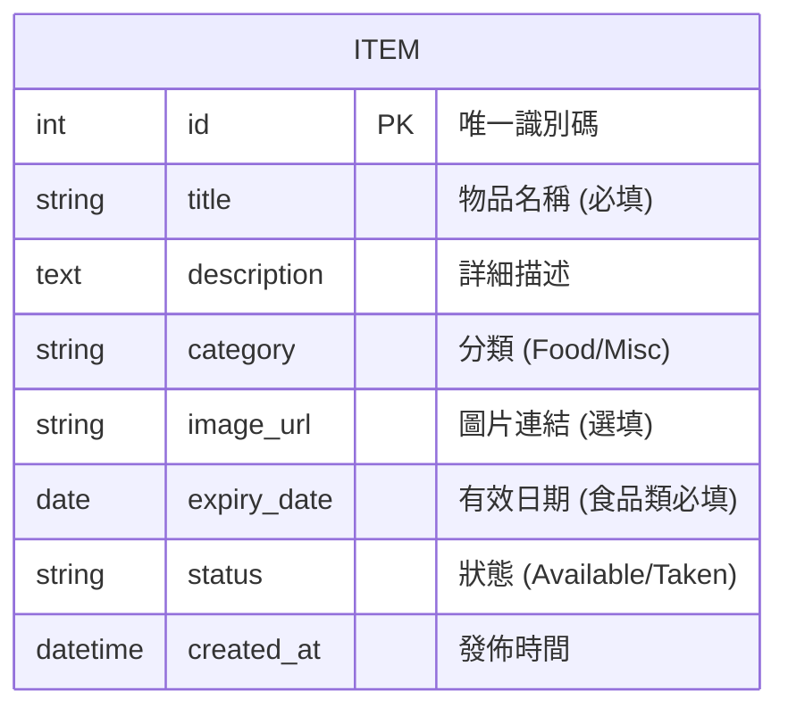

# [剩食與雜物互助系統] 資料庫設計 (DB Design)

## 1. ER 圖 (Entity Relationship Diagram)

本系統初期邏輯簡單，主要圍繞「物品 (Item)」進行資料管理。



---

## 2. 資料表詳細說明

### ITEM 資料表 (物品資訊)

| 欄位名稱 | 型別 | 必填 | 說明 |
| :--- | :--- | :--- | :--- |
| **id** | INTEGER | 是 | Primary Key, 自動遞增。 |
| **title** | VARCHAR(100) | 是 | 物品的標題。 |
| **description** | TEXT | 否 | 物品的詳細說明、領取地點等。 |
| **category** | VARCHAR(20) | 是 | 分類，限 `Food` 或 `Misc`。 |
| **image_url** | VARCHAR(500) | 否 | 物品的圖片連結位址。 |
| **expiry_date** | DATE | 否 | 若為食品則建議填寫，過期後系統會自動隱藏。 |
| **status** | VARCHAR(20) | 是 | 預設為 `Available`，領取後改為 `Taken`。 |
| **created_at** | DATETIME | 是 | 資料建立時間，預設為 `CURRENT_TIMESTAMP`。 |

---

## 3. SQL 建表語法 (SQLite)

檔案路徑：`database/schema.sql`

```sql
-- 建立物品資料表
CREATE TABLE IF NOT EXISTS items (
    id INTEGER PRIMARY KEY AUTOINCREMENT,
    title VARCHAR(100) NOT NULL,
    description TEXT,
    category VARCHAR(20) NOT NULL, -- 'Food' or 'Misc'
    image_url VARCHAR(500),
    expiry_date DATE,
    status VARCHAR(20) DEFAULT 'Available', -- 'Available' or 'Taken'
    created_at DATETIME DEFAULT CURRENT_TIMESTAMP
);

-- 建立索引以優化篩選效能
CREATE INDEX idx_item_status_category ON items(status, category);
CREATE INDEX idx_item_expiry ON items(expiry_date);
```

---

## 4. Python Model 程式碼 (SQLAlchemy)

檔案路徑：`app/models/item.py`

```python
from datetime import datetime
from flask_sqlalchemy import SQLAlchemy

db = SQLAlchemy()

class Item(db.Model):
    __tablename__ = 'items'

    id = db.Column(db.Integer, primary_key=True, autoincrement=True)
    title = db.Column(db.String(100), nullable=False)
    description = db.Column(db.Text, nullable=True)
    category = db.Column(db.String(20), nullable=False)  # 'Food', 'Misc'
    image_url = db.Column(db.String(500), nullable=True)
    expiry_date = db.Column(db.Date, nullable=True)
    status = db.Column(db.String(20), default='Available') # 'Available', 'Taken'
    created_at = db.Column(db.DateTime, default=datetime.utcnow)

    def __repr__(self):
        return f'<Item {self.title}>'

    @classmethod
    def get_all_available(cls):
        """取得所有狀態為 Available 且未過期的物品"""
        now = datetime.utcnow().date()
        return cls.query.filter(
            cls.status == 'Available',
            db.or_(
                cls.expiry_date >= now,
                cls.expiry_date == None
            )
        ).order_by(cls.created_at.desc()).all()

    @classmethod
    def get_by_category(cls, category):
        """按分類篩選有效物品"""
        now = datetime.utcnow().date()
        return cls.query.filter(
            cls.status == 'Available',
            cls.category == category,
            db.or_(
                cls.expiry_date >= now,
                cls.expiry_date == None
            )
        ).order_by(cls.created_at.desc()).all()

    def mark_as_taken(self):
        """標記為已領取"""
        self.status = 'Taken'
        db.session.commit()
```
