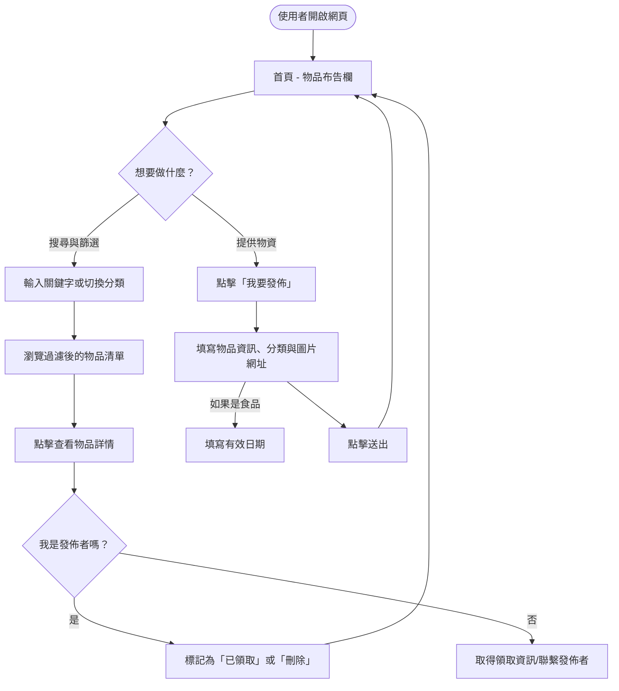
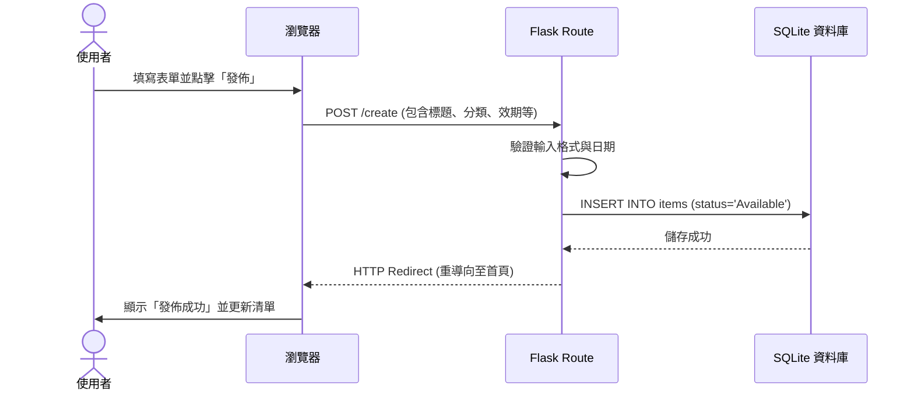
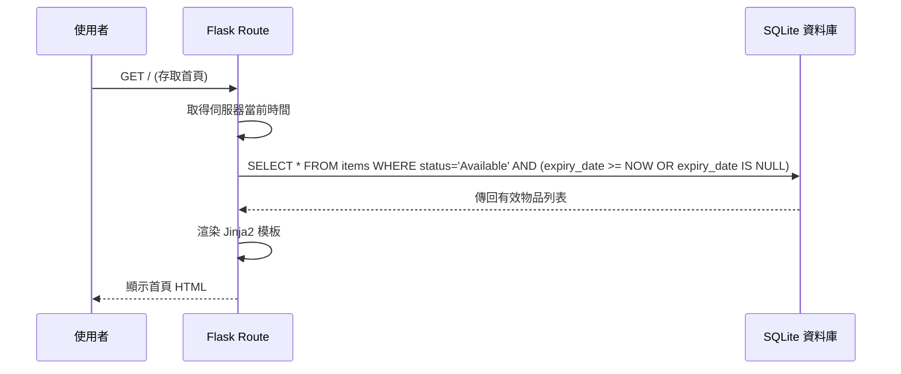

# [剩食與雜物互助系統] 流程圖設計 (Flowchart)

## 1. 使用者流程圖 (User Flow)

此圖展示了大學生進入系統後的主要操作路徑。

---

## 2. 系統序列圖 (Sequence Diagram)

以「發佈物品」與「首頁載入（含過期過濾）」為例，展示資料在元件間的流動。

### A. 發佈物品流程

### B. 首頁載入流程 (含自動隱藏過期食品)

---

## 3. 功能清單對照表 (URL Routes)

| 功能 | 頁面/動作 | URL 路徑 | HTTP 方法 | 說明 |
| :--- | :--- | :--- | :--- | :--- |
| **首頁** | 查看物品列表 | `/` | `GET` | 顯示所有可用的剩食與雜物 |
| **搜尋/篩選** | 搜尋物品 | `/` | `GET` | 透過 query string (如 `?q=蘋果&cat=food`) 進行過濾 |
| **發佈頁面** | 填寫發佈表單 | `/create` | `GET` | 顯示發佈物品的表單頁面 |
| **執行發佈** | 提交物品資料 | `/create` | `POST` | 將資料存入資料庫並重導向至首頁 |
| **物品詳情** | 查看單一物品 | `/item/<id>` | `GET` | 顯示物品詳細描述與大圖 |
| **標記已領取** | 更新物品狀態 | `/item/<id>/take` | `POST` | 將狀態改為 `Taken` 並在首頁隱藏 |
| **刪除物品** | 移除物品 | `/item/<id>/delete` | `POST` | 從資料庫或顯示清單中移除該物品 |
